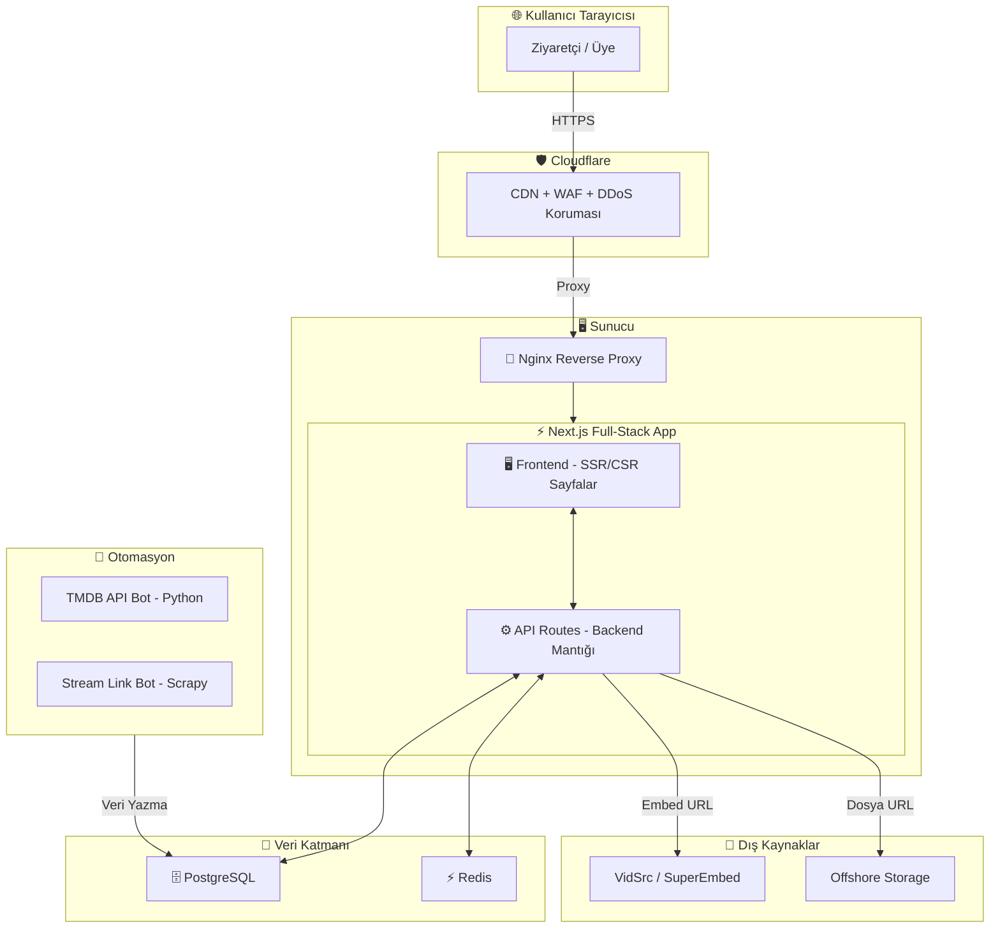
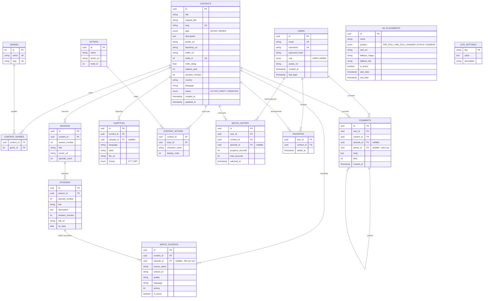
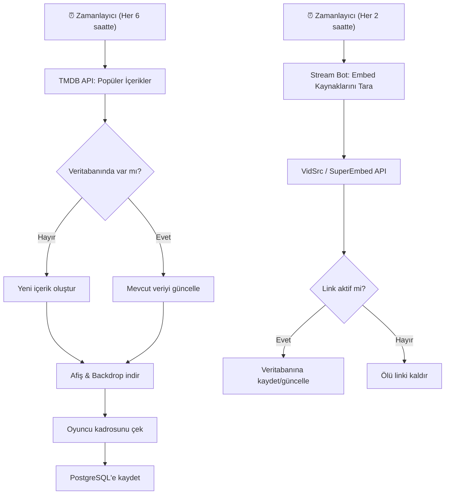

# 🎬 FullFilmİzle — Dizi & Film İzleme Platformu Uygulama Planı

Kullanıcının paylaştığı mimariye dayalı, Next.js full-stack (API Routes) + PostgreSQL + Redis + Python otomasyon botu kullanarak profesyonel bir dizi/film izleme platformu oluşturma planı.

---

## 🏗️ Genel Mimari Özeti



---

## Kullanıcı İncelemesi Gereken Konular

> [!IMPORTANT]
> **Reklam Sistemi**: VAST/VPAID reklam entegrasyonu yasal ve teknik açıdan dikkatli ele alınmalıdır. Hangi reklam ağıyla çalışacağınızı (Google AdSense, PopAds, vb.) belirlememiz gerekiyor.

> [!WARNING]
> **Telif Hakkı**: Dış embed sağlayıcıları (VidSrc, SuperEmbed) üzerinden içerik sunumu yasal riskler taşıyabilir. Bu konu tamamen sizin sorumluluğunuzdadır.

> [!IMPORTANT]
> **Domain & Hosting**: Hangi sunucu sağlayıcıyı kullanacağınız (VPS, dedicated server) ve domain bilgisi gerekli. Cloudflare entegrasyonu için DNS yönlendirmesi yapılacak.

---

## Açık Sorular

> [!IMPORTANT]
> 1. **Üyelik sistemi**: Ücretsiz mi olacak yoksa premium üyelik (aylık abonelik) modeli de olacak mı?
> 2. **Dil desteği**: Sadece Türkçe mi yoksa çoklu dil desteği olacak mı?
> 3. **Mobil uygulama**: İleride React Native veya PWA ile mobil destek planınız var mı?
> 4. **Reklam ağı**: Hangi reklam sağlayıcısını kullanmayı düşünüyorsunuz?
> 5. **Altyazı kaynağı**: Altyazılar nereden çekilecek? (OpenSubtitles API, manuel yükleme, vb.)
> 6. **İçerik kapsamı**: Sadece yabancı diziler mi yoksa yerli diziler + filmler de dahil mi?

---

## 📁 Proje Dosya Yapısı (Önerilen)

```
fullfilmizle/
├── 📂 src/
│   ├── 📂 app/                          # Next.js App Router
│   │   ├── layout.tsx                   # Ana layout (Header, Footer, Meta)
│   │   ├── page.tsx                     # Ana sayfa
│   │   ├── globals.css                  # Global stiller
│   │   ├── 📂 (auth)/                   # Auth grup rotası
│   │   │   ├── giris/page.tsx           # Giriş sayfası
│   │   │   └── kayit/page.tsx           # Kayıt sayfası
│   │   ├── 📂 diziler/
│   │   │   ├── page.tsx                 # Tüm diziler listesi
│   │   │   └── 📂 [slug]/
│   │   │       ├── page.tsx             # Dizi detay sayfası
│   │   │       └── 📂 [sezon]/
│   │   │           └── 📂 [bolum]/
│   │   │               └── page.tsx     # Bölüm izleme sayfası
│   │   ├── 📂 filmler/
│   │   │   ├── page.tsx                 # Tüm filmler listesi
│   │   │   └── 📂 [slug]/
│   │   │       └── page.tsx             # Film detay + izleme
│   │   ├── 📂 kategoriler/
│   │   │   └── 📂 [kategori]/
│   │   │       └── page.tsx             # Kategoriye göre listeleme
│   │   ├── 📂 arama/
│   │   │   └── page.tsx                 # Arama sonuçları
│   │   ├── 📂 profil/
│   │   │   └── page.tsx                 # Kullanıcı profili
│   │   ├── 📂 admin/                    # Admin paneli
│   │   │   ├── layout.tsx
│   │   │   ├── page.tsx                 # Dashboard
│   │   │   ├── 📂 icerikler/
│   │   │   ├── 📂 kullanicilar/
│   │   │   ├── 📂 reklamlar/
│   │   │   └── 📂 ayarlar/
│   │   └── 📂 api/                      # API Routes
│   │       ├── 📂 auth/
│   │       │   ├── giris/route.ts
│   │       │   ├── kayit/route.ts
│   │       │   └── cikis/route.ts
│   │       ├── 📂 diziler/
│   │       │   ├── route.ts             # GET: Liste, POST: Ekle
│   │       │   └── 📂 [id]/
│   │       │       ├── route.ts         # GET: Detay, PUT, DELETE
│   │       │       └── 📂 bolumler/
│   │       │           └── route.ts
│   │       ├── 📂 filmler/
│   │       │   ├── route.ts
│   │       │   └── 📂 [id]/route.ts
│   │       ├── 📂 arama/route.ts
│   │       ├── 📂 kullanici/route.ts
│   │       └── 📂 admin/
│   │           ├── 📂 istatistik/route.ts
│   │           └── 📂 reklamlar/route.ts
│   ├── 📂 components/
│   │   ├── 📂 ui/                       # Temel UI bileşenleri
│   │   │   ├── Button.tsx
│   │   │   ├── Input.tsx
│   │   │   ├── Modal.tsx
│   │   │   ├── Skeleton.tsx
│   │   │   └── Badge.tsx
│   │   ├── 📂 layout/
│   │   │   ├── Header.tsx               # Üst menü, arama, profil
│   │   │   ├── Footer.tsx
│   │   │   ├── Sidebar.tsx
│   │   │   └── MobileNav.tsx
│   │   ├── 📂 cards/
│   │   │   ├── ContentCard.tsx          # Film/dizi kartı
│   │   │   ├── EpisodeCard.tsx          # Bölüm kartı
│   │   │   └── ActorCard.tsx            # Oyuncu kartı
│   │   ├── 📂 sections/
│   │   │   ├── HeroSlider.tsx           # Ana sayfa slider
│   │   │   ├── TrendingSection.tsx      # Trend içerikler
│   │   │   ├── ContinueWatching.tsx     # Kaldığın yerden devam
│   │   │   └── CategoryRow.tsx          # Kategori satırı
│   │   ├── 📂 player/
│   │   │   ├── VideoPlayer.tsx          # Ana video oynatıcı
│   │   │   ├── EmbedPlayer.tsx          # iframe embed wrapper
│   │   │   ├── SubtitleSelector.tsx     # Altyazı seçici
│   │   │   └── SourceSelector.tsx       # Kaynak seçici
│   │   └── 📂 admin/
│   │       ├── AdminSidebar.tsx
│   │       ├── ContentForm.tsx
│   │       └── StatsCard.tsx
│   ├── 📂 lib/
│   │   ├── db.ts                        # PostgreSQL bağlantısı (Prisma)
│   │   ├── redis.ts                     # Redis bağlantısı
│   │   ├── auth.ts                      # NextAuth.js yapılandırması
│   │   ├── tmdb.ts                      # TMDB API istemcisi
│   │   └── utils.ts                     # Yardımcı fonksiyonlar
│   ├── 📂 hooks/
│   │   ├── useAuth.ts
│   │   ├── useSearch.ts
│   │   └── useWatchHistory.ts
│   └── 📂 types/
│       ├── content.ts                   # Film/Dizi tipleri
│       ├── user.ts                      # Kullanıcı tipleri
│       └── api.ts                       # API response tipleri
├── 📂 prisma/
│   ├── schema.prisma                    # Veritabanı şeması
│   ├── seed.ts                          # Başlangıç verileri
│   └── 📂 migrations/
├── 📂 bot/                              # Python otomasyon botu
│   ├── requirements.txt
│   ├── tmdb_scraper.py                  # TMDB API entegrasyonu
│   ├── stream_scraper.py                # Stream link toplama
│   └── config.py
├── 📂 docker/
│   ├── docker-compose.yml               # Tüm servislerin orchestration'ı
│   ├── Dockerfile.app                   # Next.js uygulaması
│   ├── Dockerfile.bot                   # Python bot
│   └── nginx.conf                       # Nginx yapılandırması
├── 📂 public/
│   ├── 📂 images/
│   └── 📂 fonts/
├── .env.example
├── .env.local
├── next.config.ts
├── tailwind.config.ts                   # (Opsiyonel - tercih edilirse)
├── tsconfig.json
└── package.json
```

---

## 🗄️ Veritabanı Şeması (PostgreSQL + Prisma)



---

## 📄 Sayfa Tasarımları ve Özellikleri

### 1. 🏠 Ana Sayfa (`/`)
| Bölüm | Açıklama |
|-------|----------|
| **Hero Slider** | Öne çıkan 5-8 içerik, otomatik geçişli, büyük backdrop görseli, başlık, açıklama, "İzle" butonu |
| **Kaldığın Yerden Devam** | Giriş yapmış kullanıcılara, yarım kalan içerikleri progress bar ile gösterir |
| **Trend Diziler** | Redis'ten çekilen, son 7 günde en çok izlenen diziler (yatay kaydırma) |
| **Yeni Eklenenler** | Son eklenen içerikler, tarih sıralamasıyla |
| **Popüler Filmler** | En yüksek IMDB puanlı filmler |
| **Kategori Satırları** | Aksiyon, Komedi, Bilim Kurgu vb. her kategori için yatay slider |

### 2. 📺 Dizi Detay (`/diziler/[slug]`)
| Bölüm | Açıklama |
|-------|----------|
| **Backdrop + Bilgi** | Büyük arka plan görseli, başlık, IMDB puanı, yıl, süre, ülke |
| **Aksiyon Butonları** | "İzlemeye Başla", "Favorilere Ekle", "Fragman İzle" |
| **Özet** | TMDB'den çekilen detaylı açıklama |
| **Sezon Seçici** | Tab veya dropdown ile sezon seçimi |
| **Bölüm Listesi** | Seçilen sezonun bölümleri, thumbnail, süre, yayın tarihi |
| **Oyuncu Kadrosu** | Yatay kaydırmalı oyuncu kartları |
| **Benzer Diziler** | Aynı kategorideki öneriler |
| **Yorumlar** | Kullanıcı yorumları, beğeni, yanıt sistemi |

### 3. 🎬 İzleme Sayfası (`/diziler/[slug]/[sezon]/[bolum]`)
| Bölüm | Açıklama |
|-------|----------|
| **Video Player** | Tam genişlik embed player, kaynak seçici, altyazı seçici |
| **Bölüm Bilgisi** | Başlık, sezon/bölüm numarası, açıklama |
| **Navigasyon** | "Önceki Bölüm" / "Sonraki Bölüm" butonları |
| **Diğer Bölümler** | Aynı sezonun diğer bölümleri, küçük liste |
| **Yorumlar** | Bölüme özel yorumlar |

### 4. 🎞️ Filmler (`/filmler` ve `/filmler/[slug]`)
- Dizilerle benzer yapı, ancak sezon/bölüm hiyerarşisi yok
- Doğrudan izleme sayfası ile birleşik detay sayfası

### 5. 🔍 Arama (`/arama?q=...`)
- Gerçek zamanlı arama (debounced)
- Tür, yıl, IMDB puanı filtresi
- PostgreSQL full-text search + Redis önbelleği

### 6. 👤 Profil (`/profil`)
- İzleme geçmişi
- Favoriler listesi
- Hesap ayarları

### 7. 🔐 Admin Paneli (`/admin`)
- İçerik yönetimi (CRUD)
- Kullanıcı yönetimi
- Reklam yönetimi
- Site ayarları
- İstatistik dashboard'u

---

## ⚙️ Teknoloji Yığını ve Paketler

### Frontend & Backend (Next.js)
| Paket | Amaç |
|-------|------|
| `next@14` | Full-stack framework (App Router) |
| `react@18` | UI kütüphanesi |
| `typescript` | Tip güvenliği |
| `prisma` + `@prisma/client` | PostgreSQL ORM |
| `next-auth` | Kimlik doğrulama (JWT tabanlı) |
| `ioredis` | Redis istemcisi |
| `zod` | API input validasyonu |
| `bcryptjs` | Şifre hash'leme |
| `sharp` | Görsel optimizasyonu |
| `framer-motion` | Animasyonlar |
| `swiper` | Slider/kaydırma bileşeni |
| `react-icons` | İkon seti |
| `date-fns` | Tarih formatlama |
| `slugify` | URL-dostu slug oluşturma |

### Video Player
| Paket | Amaç |
|-------|------|
| `plyr-react` veya `video.js` | Video oynatıcı |
| VAST/VPAID | Reklam entegrasyonu (CDN üzerinden) |

### Python Otomasyon Botu
| Paket | Amaç |
|-------|------|
| `requests` | TMDB API istekleri |
| `scrapy` | Web scraping (stream link toplama) |
| `psycopg2` | PostgreSQL bağlantısı |
| `schedule` | Zamanlanmış görevler |
| `python-dotenv` | Ortam değişkenleri |

### Altyapı
| Araç | Amaç |
|------|------|
| `Docker` + `docker-compose` | Konteyner orkestrasyonu |
| `Nginx` | Reverse proxy, SSL terminasyonu |
| `Cloudflare` | CDN, DDoS koruması, DNS |
| `PostgreSQL 16` | İlişkisel veritabanı |
| `Redis 7` | Önbellekleme, oturum yönetimi |

---

## 🔄 Redis Önbellekleme Stratejisi

```
┌─────────────────────────────────────────────────────────┐
│                    Redis Anahtar Yapısı                  │
├─────────────────────────────────────────────────────────┤
│ trending:weekly          → Son 7 gün trend içerikler    │
│ trending:daily           → Bugünün trend içerikleri      │
│ content:{id}             → İçerik detayı (TTL: 1 saat)  │
│ content:{id}:sources     → İzleme kaynakları (TTL: 30dk)│
│ search:{query}           → Arama sonuçları (TTL: 15dk)  │
│ session:{token}          → Kullanıcı oturumu (TTL: 24s) │
│ user:{id}:watchlist      → İzleme listesi               │
│ stats:views:{content_id} → Görüntülenme sayacı          │
│ homepage:sections        → Ana sayfa bölümleri (TTL: 5dk)│
└─────────────────────────────────────────────────────────┘
```

---

## 🤖 Otomasyon Botu Akışı



---

## 🛡️ Güvenlik Önlemleri

| Katman | Önlem |
|--------|-------|
| **Cloudflare** | WAF kuralları, rate limiting, bot koruması, DDoS mitigasyonu |
| **Nginx** | IP başına istek limiti, CORS başlıkları, güvenlik header'ları (HSTS, CSP, X-Frame) |
| **Next.js API** | JWT doğrulama, Zod ile input validasyonu, CSRF koruması |
| **Veritabanı** | Prisma ile parametreli sorgular (SQL injection koruması), şifrelenmiş bağlantı |
| **Kullanıcı** | bcrypt ile şifre hash'leme, rate-limited giriş denemeleri, HttpOnly çerezler |
| **Admin** | Rol tabanlı erişim kontrolü (RBAC), admin IP beyaz listesi |

---

## 🚀 Geliştirme Fazları (Yol Haritası)

### Faz 1: Temel Altyapı (1-2 Hafta)
- [x] Proje planı oluşturma ← **Şu an buradayız**
- [ ] Next.js projesi kurulumu (App Router + TypeScript)
- [ ] PostgreSQL + Prisma şema tasarımı ve migration
- [ ] Redis bağlantısı
- [ ] Docker Compose yapılandırması (PostgreSQL + Redis + App)
- [ ] Temel tasarım sistemi (renk paleti, tipografi, bileşenler)

### Faz 2: Kimlik Doğrulama & Kullanıcı Sistemi (3-4 Gün)
- [ ] NextAuth.js ile giriş/kayıt
- [ ] JWT tabanlı oturum yönetimi
- [ ] Kullanıcı profili sayfası
- [ ] Rol sistemi (USER / ADMIN)

### Faz 3: İçerik Yönetimi & Frontend (1-2 Hafta)
- [ ] Ana sayfa (Hero Slider, Trend, Kategori satırları)
- [ ] Dizi detay sayfası (sezon/bölüm hiyerarşisi)
- [ ] Film detay sayfası
- [ ] Arama sistemi (full-text search)
- [ ] Kategori filtreleme
- [ ] Responsive tasarım (mobil uyumluluk)

### Faz 4: Video Oynatıcı (3-5 Gün)
- [ ] Embed player bileşeni (iframe wrapper)
- [ ] Kaynak seçici (çoklu embed desteği)
- [ ] Altyazı yükleyici (.vtt/.srt)
- [ ] İzleme geçmişi & kaldığın yerden devam
- [ ] Sonraki bölüm otomatik geçiş

### Faz 5: Otomasyon Botu (1 Hafta)
- [ ] TMDB API entegrasyonu (içerik, afiş, oyuncu çekme)
- [ ] Stream link scraper (VidSrc, SuperEmbed)
- [ ] Zamanlanmış görev sistemi
- [ ] Ölü link temizleyici

### Faz 6: Admin Paneli (3-5 Gün)
- [ ] Admin dashboard (istatistikler, grafikler)
- [ ] İçerik CRUD arayüzü
- [ ] Kullanıcı yönetimi
- [ ] Reklam yönetimi (VAST URL, banner ayarları)
- [ ] Site ayarları

### Faz 7: Optimizasyon & Yayın (1 Hafta)
- [ ] Redis önbellekleme katmanı
- [ ] SEO optimizasyonu (meta tags, sitemap, structured data)
- [ ] Performans optimizasyonu (lazy loading, ISR, image optimization)
- [ ] Nginx yapılandırması
- [ ] Cloudflare DNS & CDN ayarları
- [ ] Production deployment

---

## 🔧 Docker Compose Yapılandırması (Özet)

```yaml
# docker-compose.yml yapısı
services:
  app:        # Next.js uygulaması (port 3000)
  postgres:   # PostgreSQL 16 (port 5432)
  redis:      # Redis 7 (port 6379)
  nginx:      # Nginx reverse proxy (port 80, 443)
  bot:        # Python otomasyon botu (cron tabanlı)
```

---

## Doğrulama Planı

### Otomatik Testler
- `npm run lint` — ESLint ile kod kalitesi kontrolü
- `npm run build` — Başarılı production build
- `npx prisma db push` — Veritabanı şemasının doğrulanması
- API endpoint testleri (Postman collection)

### Manuel Doğrulama
- Tüm sayfalarda responsive tasarım kontrolü (mobil, tablet, masaüstü)
- Video player'ın farklı embed kaynaklarıyla çalışma testi
- Kullanıcı akışları: kayıt → giriş → izleme → favorilere ekleme → yorum
- Admin paneli: içerik ekleme → düzenleme → silme akışı
- Lighthouse performans ve SEO skoru kontrolü (hedef: 90+)
